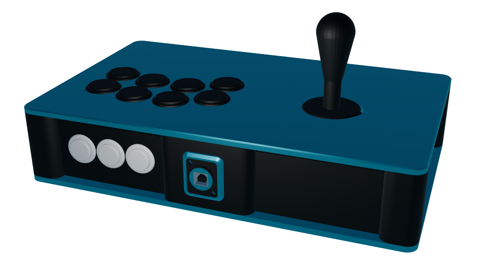

# C.H.I.M.E.R.A
## When you absolutely need every option

---

This case is intended for a complete build that sacrifices portability for versatility.

## Materials needed

In general:
- 8 5.5x2mm square nuts
- 8 M3x10 countersunk screws
- 24 10 x 3mm round magnets
- Filament for the body and plates
	- Not an endorsement, but I use PolyMaker's PolyTerra PLA line for my builds (matte rules !). You can make the contrast even more striking by having one filament matte and the other glossy
- A Brook board of your choosing (or GP2040 board if you can grab one where you live, even better)
- Cables and wires to connect the above to the rest of the hardware (usually a USB B to A and a wire harness)
- One Neutrik USB A to B connector
- 2 M3x40 screws and matching nuts to mount the Neutrik connector (head to taste; I like machine head for that purpose)
- 5 24mm arcade buttons for START, SELECT and HOME, L3 and R3
- (OPTIONAL) Four extra nuts and button or machine head screws to mount the Brook board to the top plate (you don't *need* to but it's always a plus)
- (OPTIONAL) 20mm rocker switches (one SPST for the tournament lock, one SPDT for the LS/DP/RS switch)

For the joystick based top left halves **except the American one**:
- 4 5.5x2mm square nuts
- 4 M3 screws, any length between 4 and 6mm should work (if not use spacers, don't screw through your top plate)

For the American chonky boi:
- 4 M5 square nuts
- 4 M5 screws (same deal as above)

For the buttons based top left halves:
- As many 24mm **screw-in** buttons as you wish to connect (within reason)

For the top right halves:
- 6 to 8 30mm **screw in** buttons of your choosing

## Printing

- Slice the body file
	- Add pauses to insert the nuts and magnets (you need to pause at the start of the layer that will cover and enclose the nut; I suggest watching tutorials on "how to add magnets to 3D prints" to get a feel on how to do this in your slicer)
	- Add support blockers to the nut and magnet holes and the Neutrik mounting points. Make sure the support blockers cover the entire holes !
- Print the body parts. This is the longest part to print so I recommend making sure you'll be around to add the nuts in order to minimize downtime. Unless you have a MMU or are *that* confident in your ability to remove supports, I suggest using PLA over any other material. If you do have a MMU, PETG works really well too. (Haven't tested any other filament)
- Do the same pause/filament change trick for the top panels to add nuts if needed. Slice the plates upside down
	- Don't add blockers to the Brook mounting holes if you don't intend to mount it
- Then print the plates !
- (OPTIONAL) Print the Neutrik surround and support in the same material/color as the plates
- (OPTIONAL) If your screws are too long to properly attach the mainboard, print a spacer !

## Assembly

Insert the magnets into your top plates. Use all-purpose pliers if you need to (add some cloth between the jaws and plate if you're afraid of damaging them)

Screw the mainboard to the underside of the top right panel half (with or without the spacer). Make sure to orient the board so that the USB-B port is facing towards the center.

You may want to start on wiring some of the electronics now. Screw in the buttons (and lever), then attach the wire harness. Refer to your board's manual for the correct pinout. Despite the size it's actually a pretty tight fit, so bend and twist pins and wires as you need.

Add the five option buttons to the right half of the body.

Connect the option buttons to the rest of the wire harness.

Connect the board to the Neutrik via a USB B to A cable.

Use the countersunk screws to attach the bottom panel to the body. You may need to apply some moderate force to compress the wires inside the case. Aaaaaand you're done, congratulations ! 

## Acknowledgements

- [Buttercade](https://www.etsy.com/shop/BUTTERCADE) for the Surround and Support project
- [Junk Food Arcades](https://junkfoodarcades.com) for the Snack Box v2, which genuinely coincidentally happen to share a lot of general shapes with my projects)
