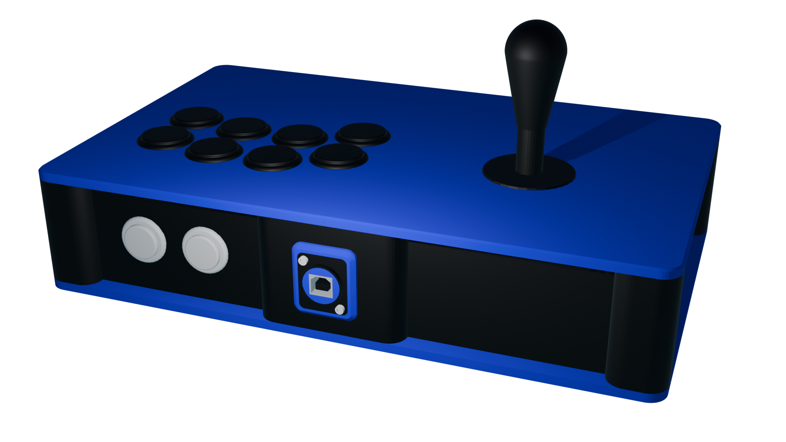

# C.H.I.M.E.R.A
## When you absolutely need every option

---

This case is intended for a complete build that sacrifices (a bit of) portability for versatility.
Unlike other models, all the STL files should fit on a standard 220x220mm build plate from the get go (it's a bit of a tight fit though but it should be okay so long as you don't need a brim or raft)

## Materials needed

In general:
- 8 5.5x2mm square nuts
- 8 M3x10 countersunk screws
- 24 10 x 3mm round magnets
- Filament for the body and plates
	- Not an endorsement, but I use PolyMaker's PolyTerra PLA line for my builds (matte rules !). You can make the contrast even more striking by having one filament matte and the other glossy
- A Brook board of your choosing (or GP2040 board if you can grab one where you live, even better)
- Cables and wires to connect the above to the rest of the hardware (usually a USB B to A and a wire harness)
	- **The 20pin Brook harness is mandatory if you mount the board to the underside of the top right panel.** If you don't you can use the 20 pin terminals just fine, otherwise you may need a riser
- One Neutrik USB A to B connector
- 2 M3x40 screws and matching nuts to mount the Neutrik connector (head to taste; I like machine head for that purpose)
- 5 24mm arcade buttons for START, SELECT and HOME, L3 and R3
- (OPTIONAL) Four extra nuts and button or machine head screws to mount the Brook board to the top plate (you don't *need* to but it's always a plus)
- Glue, or if you're extra paranoid, two part epoxy
- (OPTIONAL) 20mm rocker switches (one SPST for the tournament lock, one SPDT for the LS/DP/RS switch)

For the joystick based top left halves **except the American one**:
- 4 5.5x2mm square nuts
- 4 M3 screws, any length between 4 and 6mm should work (if not use spacers, don't screw through your top plate)

For the American chonky boi:
- 4 M5 square nuts
- 4 M5 screws (same deal as above)

For the buttons based top left halves:
- As many 24mm **screw-in** buttons as you wish to connect (within reason)

For the top right halves:
- 6 to 8 30mm **screw in** buttons of your choosing

## Printing

- Slice the body file
	- Add pauses to insert the nuts and magnets (you need to pause at the start of the layer that will cover and enclose the nut; I suggest watching tutorials on "how to add magnets to 3D prints" to get a feel on how to do this in your slicer)
	- Add support blockers to the nut and magnet holes and the Neutrik mounting points. Make sure the support blockers cover the entire holes !
- Print the body parts. This is the longest part to print so I recommend making sure you'll be around to add the nuts in order to minimize downtime. Unless you have a MMU or are *that* confident in your ability to remove supports, I suggest using PLA over any other material. If you do have a MMU, PETG works really well too. (Haven't tested any other filament)
- Do the same pause/filament change trick for the top panels to add nuts if needed. Slice the plates upside down
	- Don't add blockers to the Brook mounting holes if you don't intend to mount it
- Then print the plates !
- (OPTIONAL) Print the Neutrik surround and support in the same material/color as the plates
- (OPTIONAL) If your screws are too long to properly attach the mainboard, print a spacer !

## Assembly

> [!NOTE]
> This is how *I* would proceed. At some point if you've made it this far I would assume you know your own DEX stat better than I do and can opt for a different build order.

Assemble the frame; Apply your adhesive of choice, preferably using a thin modeling brush, to the tongues on the left and right side brackets. Insert them into the front and back joints. This is a very tight fit and depending on your printer's level of tuning, you might need to apply some force.

Open up the Neutrik connector and reverse it so that the USB-B connector faces outside. Mount the Neutrik connector to the frame. Use a wrench or pliers to tighten the nuts.

Screw the board to the top right panel. Screw the buttons into the right panel. Screw the option buttons to the right side of the frame, and check that they are not overlapping with the main buttons (they *shouldn't*, but even with my trove of hardware I cannot test every possible case).

Insert the magnets into your top plates. Use all-purpose pliers if you need to (add some cloth between the jaws and plate if you're afraid of damaging anything)

> [!TIP]
> Depending on its length you may want to add the USB cable now so that it sits out of the way from the regular wiring. It mostly depends on which side you tend to open your stick by and how often; I go through the bottom so having the USB cable under the rest of the harness helps me, but to each their own !

Connect the option buttons first by snaking them through the top panel buttons. It's a really tight fit, unfortunately, but it's pretty feasible IMO. Then wire up the ground chain for the main buttons, kicks, punches, and finally whichever directional method you choose.

Screw in the bottom panels. You might need to compress the wiring a little bit.

## Acknowledgements

- [Buttercade](https://www.etsy.com/shop/BUTTERCADE) for the Surround and Support project
- [Junk Food Arcades](https://junkfoodarcades.com) for the Snack Box v2, which genuinely coincidentally happen to share a lot of general shapes with my projects)
