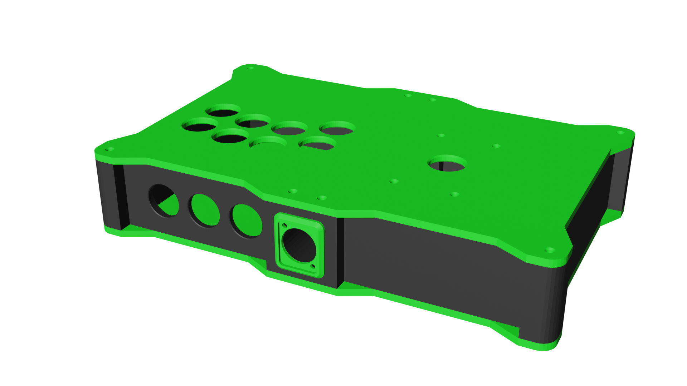

# D.W.A.R.F.
## Fightstick case for a (slightly) smaller than average build

---

This case is intended for a smaller sized build that still wishes to retain a lever. The case is barely larger than a A4 sheet at 32 x 20 centimeters.

## Materials needed

- 20 M3 countersunk screws for the case and lever mount, any length between 8 and 12mm should work
- 16 M3 heat-sink inserts
- 4 nuts and washers for mounting the lever
- About 400 grams of whatever filament you decide to print your body with
- About 400 grams of whatever filament you decide to print your plates with
- A mainboard and wires (I use Brook boards)
- 11 **screw-in 24mm** arcade buttons. Snap-ins will **NOT** work !
- A low collar lever of your choice, that has Japanese style mounting points (Sanwa JLF/JLX, any Seimitsu with the MS plate, all Sanjuks models, Crown NHM... the list is too long to be exhaustive)
   

## Printing

- Top & Bottom plates: Tested with PLA and PETG, as long as your filament has good stiffness it should work (this is my way to say "Please don't try TPU or LW-PLA/LW-ASA")
  - Brims help if you get warping, 30% grid infill with anywhere between 3 and 5 top/bottom layers. I recommend slicing the plates face down so they take on your build plate's texture
- Body: I recommend PLA; Removing the supports from the options and Neutrik holes from PETG is very hard without power tools or an IDEX system and a roll of PVB. I have *big* doubts about TPU
  - I use brims due to the wall profile, 20% triangular infill
  
Print this:
 - Top Left: 1x
 - Top Right: 1x
 - Body Left: 1x
 - Body Right: 1x
 - Front/Back joints: 1x
 - Bottom plates: 2x (they're the same plate just rotated 180°)
 
 Orientation should be good from the get-go.
  
## Building

- Assemble body (really if you ever did LEGO you should figure that one out fairly easily)
- Add heat-set inserts to the existing holes
- Screw on bottom plates
- Affix arcade hardware to the top plates
- Screw top plates onto the body
