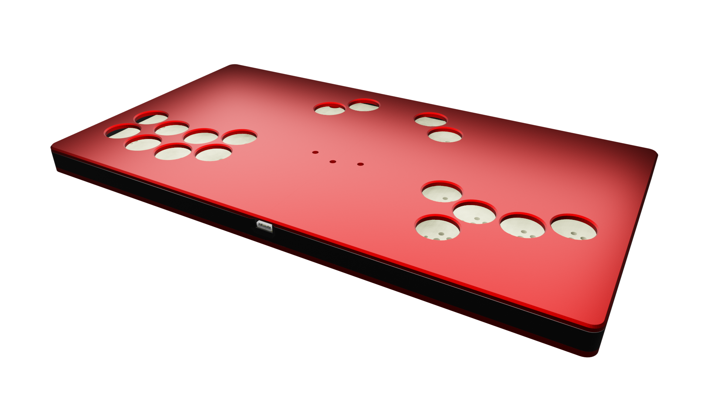

# G.O.B.L.I.N.
## Artwork-friendly Smashbox-style modular case

---

This case is intended for a flat, Smashbox-style case and custom PCB with *either* Cherry MX style or Kailh Choc *v1* style switches.

> [!IMPORTANT]
> This build cannot, to the best of my knowledge and skill, be safely split to fit on a standard 220x220mm build plate.
> You **will** need at least a 300x300mm build plate.

## Materials needed

- 4 M3 x 6 countersunk screws to attach the bottom plate to the body
- 4 M3 x 6 button or machine head screws to attach the top plate to the body
- 8 M3 heat set inserts
- 5 through hole 15mm (or taller) 6x6 tactile switches
- A bunch of *either* MX style or Kailh Choc switches and corresponding hotswap sockets if you want them to be removable (big fan of Kailh Speed Navy switches here)
	- You *can* mix and match them and have both sockets soldered at the same time; why would you though ?
- A [board]()
- A [laser cut acrylic plate](Cut\ files), 3mm thick

## Printing

- Main body: Tested mainly in PLA, PETG/PCTG/ABS/nylon probably work too
	- Infill is a bit whatever, I use 20% gyroid, up to your taste and filament
	- Tree supports mandatory for the USB-C slot
- Bottom plate: about the same as above applies
- Caps:
	- MX style: See [Rana Labs' keycaps](https://github.com/rana-sylvatica/circle-keycaps)
	- Choc style: TBD

## Building

- Print the body
- Remove support material inside the USB-C hole
- (Optional) Touch up the holes using a pin vise or something similar so the inserts fall into place easier
- Add heat-set inserts to the body
- Assemble the PCB
- Place PCB inside the body
- (Optional) Add artwork
- Place acrylic panel and screw it in place
- Place caps onto switches (do this **BEFORE** putting them on the PCB)
- Seat switches inside their assigned slots (hold the hotswaps against the board while pushing the switches in)
- Place bottom panel and screw it in place
- Plug your board in and install the firmware
