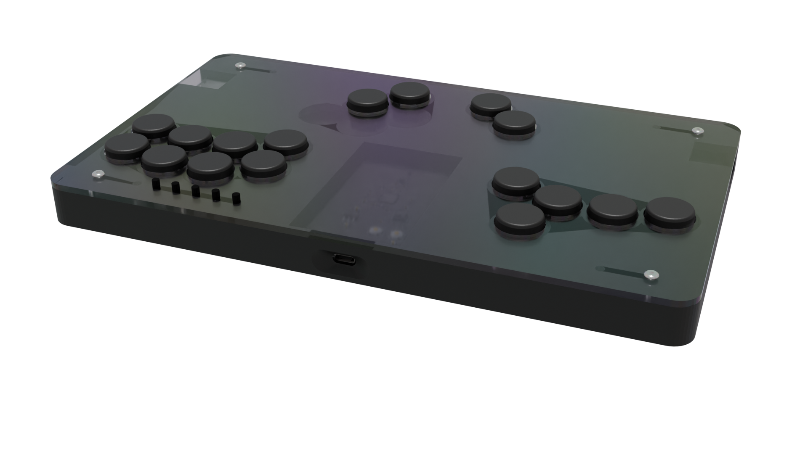

# G.O.B.L.I.N.
## Smashbox style modular case

---

This case is intended for a flat, Smashbox-styled case and custom PCB with Kailh Choc hotswappable switches. (Though it can be used for other purposes now)

## Materials needed

- 4 M3 x 8 countersunk screws to attach the bottom plate to the body
- 4 M3 x 8 countersunk screws to attach the top plate to the body
- 8 M3 heat-sink inserts **OR** M3 nuts
- 5 through hole 6x6 tactile switches (height to taste, I like 9.5mm)
- A bunch of Kailh Choc switches and corresponding hotswap sockets if you want them to be removable (big fan of Navy switches here)
- A fine instance of a [One Board](https://github.com/bad64/OneBoard)

## Printing

- Body: Tested in PLA, probably would be a cool aesthetic to use carbon fiber for added rigidity
	- Infill is a bit whatever, I use Gyroid with 20%, but whatever floats your boat
- Top & Bottom plates: Tested with PLA and PETG, as long as your filament has good stiffness it should work (this is my way to say "Please don't try TPU or LW-PLA/LW-ASA")
	- 30% zigzag or gyroid infill with anywhere between 3 and 5 top/bottom layers. I recommend slicing the plates face down so they take on your build plate's texture
- Buttons: Honestly anything that *has* infill should work. Recommend PETG over PLA if possible. TPU is kind of an acquired taste in terms of feeling
	- I used [these](https://www.thingiverse.com/thing:5368051) as a base (I don't have a Thingiverse account but I feel credit is due anyway; the author is more than welcome to get in touch if this isn't satisfactory)

Pick your top panel layout, then print one of everything !

## Building

- Add heat-set inserts to the body
- Gently layer PCB on top of body
- Place top panel
- Screw top panel to body
- Place caps onto switches (do this **BEFORE** putting them on the PCB, hotswap or not these are tight)
- Affix switches in their assigned holes
- Place bottom panel
- Screw bottom panel to body

## What's next

- Assembly guide probably idk
