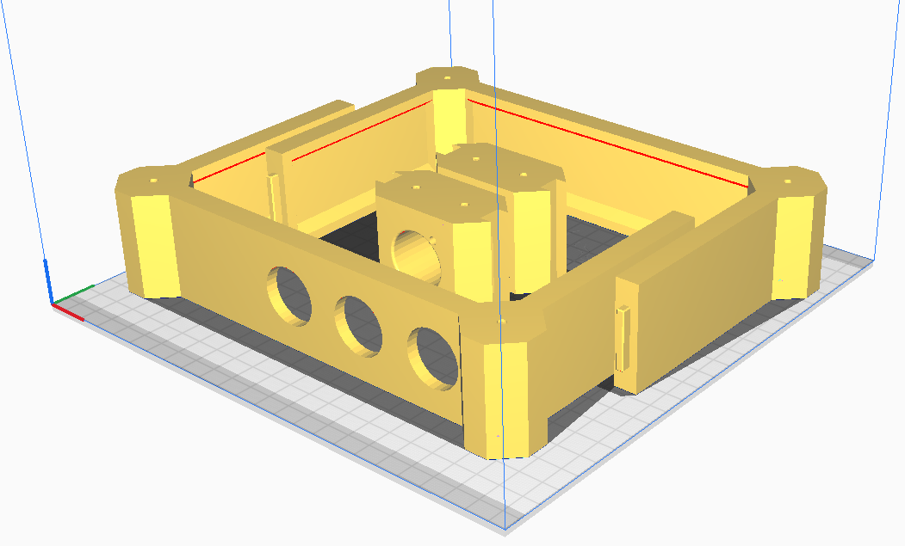

> [!IMPORTANT]
> These files are made for a 220x220mm print surface. Obviously, nothing prevents you from printing them on a larger printer, but if you have anything above 300x300mm, I would definitely recommend using those files simply because they need a little less hardware.

## Materials needed

In general:
- 16 M3 heat-set inserts
- Half of that number M3x10 button-head screws (I recommend hex screws, Phillips sucks)
- And the other half M3x10 countersunk screws
- Filament for the body and plates
	- Not an endorsement, but I use PolyMaker's PolyTerra PLA line for my builds (matte rules !). You can make the contrast even more striking by having one filament matte and the other glossy
- A Brook board of your choosing (or GP2040 board if you can grab one where you live, even better)
- Cables and wires to connect the above to the rest of the hardware (usually a USB B to A and a wire harness)
	- **The 20pin Brook harness is mandatory if you opt to screw the board to the top panel.** If you don't, you can use the screw terminals just fine. If you run your own custom sleeved wires for maximum aesthetics you might want to get a riser but it should work otherwise
- One Neutrik USB A to B connector
- 2 M3x40 screws and matching nuts to mount the Neutrik connector (head to taste; I like machine head for their look)
- 3 24mm arcade buttons for START, SELECT, and HOME
- Glue, or if you're really paranoid, two part epoxy
- (OPTIONAL) Four 5.5x2mm square nuts and button or machine head screws to mount the Brook board to the top plate (you don't *need* to but it's always a plus)

For the Sega 2P builds:
- One lever with Japanese mounting points
	- All Sanwa, Seimitsu, and Qanba levers should fit (not a hundred percent sure about the Hori Hayabusa)
	- Crown levers with the -FJ suffix will fit
	- All (known) Fanta levers will fit
	- **American levers/Eurosticks will not fit**
- Four 5.5x2mm square nuts to mount the lever to
- Four button or machine head M3 screws (any length between 3 and 6mm *should* work. Use spacers if needed, just be careful to not screw through the panel)
- The appropriate top plate for your lever (Pick the 35mm hole if you have a full collar Korean lever, otherwise the 24mm one)
- 8 **screw-in** 30mm buttons

For the WASD leverless build:
- 12 24mm **screw-in** buttons

For the Hitbox leverless build:
- 11 24mm **screw-in** buttons
- 1 30mm **screw-in** button

## Printing

Print all the body files, depending on your exact build plate size you can definitely fit several parts at once to save time:

Print the bottom plate twice, then whichever set of top plates you want. Add support blockers and filament changes/pauses (it doesn't really matter so long as the print head goes out of the way) on the lever mounting holes **at the start of the layer which will cover the nuts** if you plan on using one.

For the record, both Sega 2P top right plates are identical, but **that isn't true for the leverless builds**. Exercise caution !

If you do not wish to mount your board directly to the top right plate, print it as-is, otherwise again you will need to add a pause and support blockers.

**OPTIONAL:** Print the Surround and Support pieces for the Neutrik that you can find in the root Common folder.

## Assembly

> [!NOTE]
> This is how *I* would proceed. At some point if you've made it this far I would assume you know your own DEX stat better than I do and can opt for a different build order.

Assemble the frame; Apply your adhesive of choice, preferably using a thin modeling brush, to the tongues on the left and right side brackets. Insert them into the front and back joints. This is a very tight fit and depending on your printer's level of tuning, you might need to apply some force.

Heat up your soldering iron, and add the heat-set inserts. Let them cool down before attempting to screw anything in to let the plastic set.

Open up the Neutrik connector and reverse it so that the USB-B connector faces outside. Mount the Neutrik connector to the frame. Use a wrench or pliers to tighten the nuts.

Screw the board to the top right panel. Screw the buttons into the right panel. Screw the option buttons to the right side of the frame, and check that they are not overlapping with the main buttons (they *shouldn't*, but even with my trove of hardware I cannot test every possible case).

> [!TIP]
> Depending on its length you may want to add the USB cable now so that it sits out of the way from the regular wiring. It mostly depends on which side you tend to open your stick by and how often; I go through the bottom so having the USB cable under the rest of the harness helps me, but to each their own !

Connect the option buttons first by snaking them through the top panel buttons. It's a really tight fit, unfortunately, but it's pretty feasible IMO. Then wire up the ground chain for the main buttons, kicks, punches, and finally whichever directional method you choose.

Screw in the bottom panels. You might need to compress the wiring a little bit.
