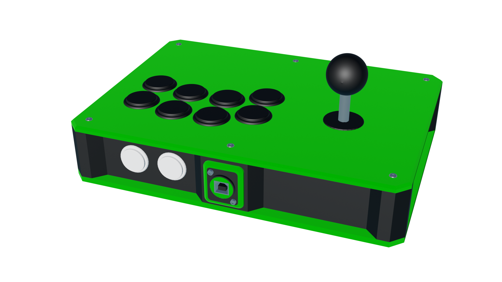

# O.R.K.
## Regular fightstick case

---

This case is intended for a (relatively) compact build with all the features you'd normally expect in a fightstick.

## Materials needed

In general:
- 5.5x2mm square nuts (12 for the 300mm build plate version, 16 for the 220mm version)
- Half of that number M3x10 button-head screws (I recommend hex screws, Phillips sucks)
- And the other half M3x10 countersunk screws
- Filament for the body and plates
	- Not an endorsement, but I use PolyMaker's PolyTerra PLA line for my builds (matte rules !). You can make the contrast even more striking by having one filament matte and the other glossy
- A Brook board of your choosing (or GP2040 board if you can grab one where you live, even better)
- Cables and wires to connect the above to the rest of the hardware (usually a USB B to A and a wire harness)
- One Neutrik USB A to B connector
- 2 M3x40 screws and matching nuts to mount the Neutrik connector (head to taste; I like machine head for that purpose)
- 3 24mm arcade buttons for START, SELECT and HOME
- (OPTIONAL) Four extra nuts and button or machine head screws to mount the Brook board to the top plate (you don't *need* to but it's always a plus)

For the Sega 2P build:
- One lever with Japanese mounting points
	- All Sanwa, Seimitsu, Hori and Qanba levers should fit
	- Crown levers with the -FJ suffix will fit
	- All (known) Fanta levers will fit
	- **American levers/Eurosticks will not fit**
- Four additional square nuts to mount the lever to
- Four button or machine head M3 screws (any length between 3 and 6mm *should* work. Use spacers if needed, just be careful to not screw through the panel)
- The appropriate top plate for your lever (Pick the 35mm hole if you have a full collar Korean lever, otherwise the 24mm one)
- 8 **screw-in** 30mm buttons

For the WASD leverless build:
- 12 24mm **screw-in** buttons

For the Hitbox leverless build:
- 11 24mm **screw-in** buttons
- 1 30mm **screw-in** button

## Printing

- Slice the body file
	- Add pauses to insert the nuts (you need to pause at the start of the layer that will cover and enclose the nut; I suggest watching tutorials on "how to add magnets to 3D prints" to get a feel on how to do this in your slicer)
	- Add support blockers to the... nut holes (*gah*) and the Neutrik mounting points. Make sure the support blockers cover the entire holes !
- Print the body. This is the longest part to print so I recommend making sure you'll be around to add the nuts in order to minimize downtime. Unless you have a MMU or are *that* confident in your ability to remove supports, I suggest using PLA over any other material. If you do have a MMU, PETG works really well too. (Haven't tested any other filament)
- Do the same pause/filament change trick for the top panel if you need to mount a lever or a Brook board to it. Don't forget the support blockers !
	- Don't add blockers to the Brook mounting holes if you don't intend to mount it
	- The plates are meant to be sliced as-is to maintain dimensional accuracy over the various chamfers, but if you're confident in your cooling you can slice them upside down so they take your build plate's texture
- Then print the plates !
- (OPTIONAL) Print the Neutrik surround and support in the same material/color as the plates
- (OPTIONAL) If your screws are too long to properly attach the mainboard, print a spacer !

## Assembly

Screw the mainboard to the underside of the top panel (with or without the spacer). Make sure to orient the board so that the USB-B port is facing towards the center.

You may want to start on wiring some of the electronics now. Screw in the buttons (and lever), then attach the wire harness. Refer to your board's manual for the correct pinout.

Add the three option buttons to the body.

Use the buttonhead screws to attach the top panel to the body. Regardless of your choice of option positions, they should be on the right hand side. (The body is symmetrical so it will work on the left, it's just going to be harder to wire due to the distance to the board)

Connect the option buttons to the rest of the wire harness.

Connect the board to the Neutrik via a USB B to A cable.

Use the countersunk screws to attach the bottom panel to the body. You may need to apply some moderate force to compress the wires inside the case. Aaaaaand you're done, congratulations ! 

## TODO

- 220mm model cut up and ready to print
- Hitbox top panel

## Acknowledgements

- [Buttercade](https://www.etsy.com/shop/BUTTERCADE) for the Surround and Support project
- [Junk Food Arcades](https://junkfoodarcades.com) for the Snack Box v2, which genuinely coincidentally happen to share a lot of general shapes with my projects)
